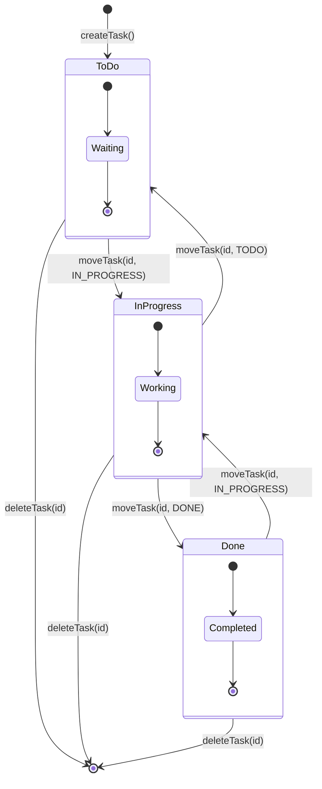
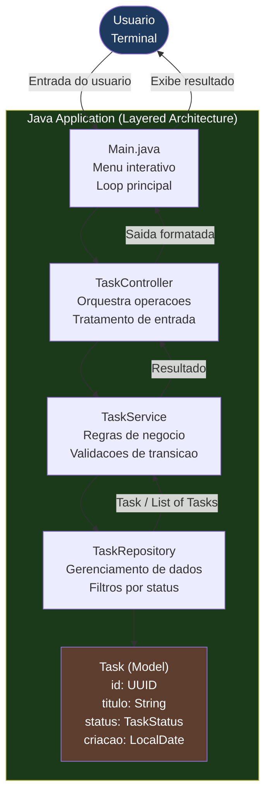

# Board de Tarefas com Java | Task Board with Java

[](https://www.oracle.com/java/)
[](https://github.com/galafis/Criando-seu-Board-de-Tarefas-com-Java)
[](https://opensource.org/licenses/MIT)

---

## Sobre o Projeto | About

**PT-BR:** Aplicacao de quadro Kanban rodando no terminal, construida com Java puro. Permite criar, listar, mover e remover tarefas entre colunas de status — uma implementacao pratica de gerenciamento de fluxo de trabalho com arquitetura em camadas.

**EN:** A terminal-based Kanban board application built with pure Java. Allows creating, listing, moving, and removing tasks across status columns — a practical implementation of workflow management with a layered architecture.

---

## Ciclo de Vida das Tarefas | Task Lifecycle



---

## Arquitetura da Aplicacao | Application Architecture



---

## Funcionalidades | Features

**PT-BR**
- Criar tarefas com titulo e data de criacao
- Listar tarefas por status (A Fazer, Em Progresso, Concluido)
- Mover tarefas entre os status do Kanban
- Remover tarefas por ID
- Interface interativa no terminal com menu

**EN**
- Create tasks with title and creation date
- List tasks by status (To Do, In Progress, Done)
- Move tasks between Kanban statuses
- Remove tasks by ID
- Interactive terminal interface with menu

---

## Demonstracao no Terminal | Terminal Demo

```
==============================
   BOARD DE TAREFAS - KANBAN
==============================
1. Criar nova tarefa
2. Listar tarefas
3. Mover tarefa
4. Remover tarefa
0. Sair
------------------------------
Opcao: 1

Titulo da tarefa: Implementar autenticacao JWT
Tarefa criada! ID: 3f7a2c1b

------------------------------
A FAZER (2):
  [3f7a2c1b] Implementar autenticacao JWT
  [9d4e8f2a] Escrever testes unitarios

EM PROGRESSO (1):
  [1b2c3d4e] Criar endpoints REST

CONCLUIDO (1):
  [5f6g7h8i] Configurar banco de dados
```

---

## Estrutura do Projeto | Project Structure

```
BoardTarefasJava/
├── src/
│   ├── model/
│   │   ├── Task.java            # Entidade tarefa | Task entity
│   │   └── TaskStatus.java      # Enum: TODO, IN_PROGRESS, DONE
│   ├── repository/
│   │   └── TaskRepository.java  # Armazenamento em memoria | In-memory storage
│   ├── service/
│   │   └── TaskService.java     # Regras de negocio | Business rules
│   ├── controller/
│   │   └── TaskController.java  # Logica de controle | Control logic
│   └── Main.java                # Ponto de entrada e menu | Entry point & menu
└── README.md
```

---

## Como Executar | Getting Started

**PT-BR**

Pre-requisitos: JDK 11 ou superior instalado.

1. Clone o repositorio:
   ```bash
   git clone https://github.com/galafis/Criando-seu-Board-de-Tarefas-com-Java.git
   cd Criando-seu-Board-de-Tarefas-com-Java
   ```

2. Compile os arquivos Java:
   ```bash
   javac -d bin src/**/*.java
   ```

3. Execute a aplicacao:
   ```bash
   java -cp bin Main
   ```

**EN**

Prerequisites: JDK 11 or higher installed.

1. Clone the repository:
   ```bash
   git clone https://github.com/galafis/Criando-seu-Board-de-Tarefas-com-Java.git
   cd Criando-seu-Board-de-Tarefas-com-Java
   ```

2. Compile Java files:
   ```bash
   javac -d bin src/**/*.java
   ```

3. Run the application:
   ```bash
   java -cp bin Main
   ```

---

## Proximos Passos | Next Steps

**PT-BR**
- Persistencia em banco de dados (MySQL / PostgreSQL)
- Interface grafica com JavaFX ou Swing
- Exposicao via API REST com Spring Boot
- Filtros e ordenacao de tarefas por data e prioridade

**EN**
- Database persistence (MySQL / PostgreSQL)
- Graphical interface with JavaFX or Swing
- Expose via REST API with Spring Boot
- Task filtering and sorting by date and priority

---

## Baseado em | Based on

Desafio da [Digital Innovation One (DIO)](https://github.com/digitalinnovationone/board), com melhorias de organizacao em camadas e extensoes de funcionalidades.

Challenge from [Digital Innovation One (DIO)](https://github.com/digitalinnovationone/board), enhanced with layered organization and additional features.

---

## Sobre o Autor | About the Author

**Gabriel Demetrios Lafis** — Cientista de Dados apaixonado por tecnologia, com interesse em desenvolvimento back-end Java e arquiteturas limpas.

[](https://github.com/galafis)

---

## Licenca | License

Este projeto esta sob a licenca MIT. | This project is licensed under the MIT License.

Veja o arquivo [LICENSE](LICENSE) para mais detalhes. | See the [LICENSE](LICENSE) file for details.
